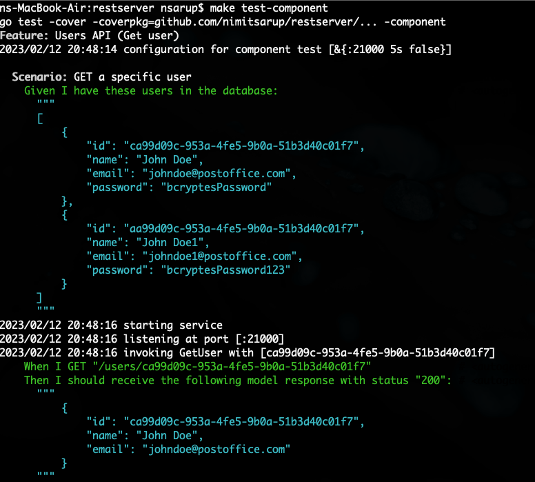
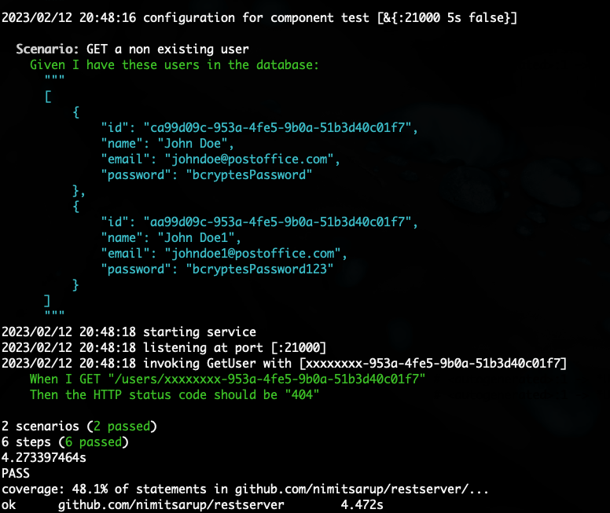

# Post Office Users Service
Simple rest server with tests (unit+integration)

#IMPORTANT
- Used in-memory database for simplicity and for benifit of saving time.
- Not targetting test coverage (added samples of unit/feature tests)

Please let me know if you would like to see an implementation with any OR both of the above (as its only enhancing the current implementation, for e.g using documentDB in cloud etc).

# Notes
- Used testify to create table based tests.
- Used godog for feature tests (see folder 'features')
- Can spin up service both locally (cmd/local/main.go) OR in the cloud as lambda (cmd/lambda/main.go).

# Lambda platform considerations
- Build the lambda as linux/arm64 (aws-lambda prefered architecture)
- The maximum time a lambda can remain hot is 15 mins (more than sufficient for a REST call)
- Payload limitation is 6MB (again more than sufficient for our use-case of a tiny json payload).
- Used aws cli to create - user-role, lambda-function and api-gateway with the 3 routes
  - Creat role - ``` aws iam create-role ..```
  - Build archive - ```make build-lambda-archive```
  - Create lambda function () -```aws lambda create-function --function-name $functionName --runtime go1.x --role $rolearn --handler main --zip-file {main.zip} ```
  - Create api gateway with 3 routes, /users POST, /users GET and /users/{id} GET ```aws apigateway create-rest-api --name pouserserviceAPI --endpoint-configuration types=REGIONAL```
  - Add routes using ```aws apigateway put-method```
  - Use api-gateway invoke URL from commandline or postman.
- The one i created in cloud - ```https://e6xjgviiaj.execute-api.eu-west-2.amazonaws.com/users```

# Makefile tagets
- Unit tests (make test)
- Integration tests (make test-component)
- Linting (make lint)
- debug, build.
- build-lambda-archive

# Sample execution
```sh
// ADD USER
nsarup@MONSTER:~/po/restserver$ curl -d '{"name":"user1", "email": "user1@postoffice", "password": "plaintext"}' -H "Content-Type: application/json" -X POST -w "%{http_code}\n" https://e6xjgviiaj.execute-api.eu-west-2.amazonaws.com/users
201

// GET ALL USERS
nsarup@MONSTER:~/po/restserver$ curl -i -X GET https://e6xjgviiaj.execute-api.eu-west-2.amazonaws.com/users
HTTP/2 200 
date: Sun, 12 Feb 2023 20:13:01 GMT
content-type: text/plain; charset=utf-8
content-length: 168
apigw-requestid: APg8HjwOrPEEPaw=

[{"id":"c6868250-f956-49fe-8bdd-4f3406ec10e7","name":"Nimit3","email":"n@saru"},{"id":"3f203913-1652-4ed7-9925-56cd7efc1d64","name":"user1","email":"user1@postoffice"}]

// GET USER BY ID
nsarup@MONSTER:~/po/restserver$ curl -i -X GET https://e6xjgviiaj.execute-api.eu-west-2.amazonaws.com/users/3f203913-1652-4ed7-9925-56cd7efc1d64
HTTP/2 200 
date: Sun, 12 Feb 2023 20:14:11 GMT
content-type: text/plain; charset=utf-8
content-length: 87
apigw-requestid: APhHBjmqrPEEPlA=

{"id":"3f203913-1652-4ed7-9925-56cd7efc1d64","name":"user1","email":"user1@postoffice"}
```

# Godog feature test

